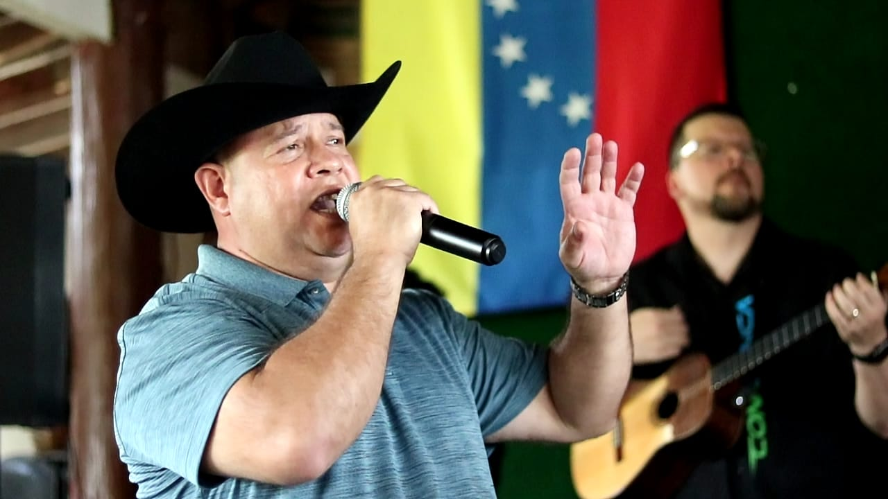

import ShowsV2 from '../src/components/shows.js'
import ReleasesV2 from '../src/components/releases.js'
import LandingSectionTitle from '../src/components/landing-section-title.js'
import BannerV2 from '../src/components/banner.js'

<BannerV2 bgOverlay="linear-gradient(280deg, #393e51 45%, #fed573 120%)"  />

<Container>

<!-- Landing page content

  Hello Mama

-->

<!-- Call to action

  <a class="gtm-button" href="#" rel="external">
    Learn More
  </a>

-->

<!-- Bio -->

  <LandingSectionTitle>{`Biografía`}</LandingSectionTitle>

Nacido en la parroquia Santa Rosalía de la ciudad de Caracas Venezuela, un 22 de Mayo de 1971, es el menor de siete hermanos. Sus padres Pedro Filiberto Jimenez Muñoz y Alicia Rosa Tabata de Jimenez ambos oriundos del Estado Anzoátegui. Desde muy temprana edad realizó estudios musicales en la Escuela Superior de Música José Angel Lamas, por lo que en el paso de su educación primaria y secundaria en el Colegio Las Acacias participa en todas las actividades musicales, tales como el Orfeón, La Estudiantina y La Banda de Guerra.

A la edad de once años obtiene su primer galardón como cantante al participar en un Talent Show en el ELS camp de Tampa, Florida con el tema Atrévete de José Luis Rodríguez (El Puma). En 1983 es invitado a participar en la Banda para los juegos Panamericanos Copán y ese mismo año demuestra su talento en varios escenarios con la Coral Capella de Caracas. Es en el año 1988 cuando comienza a desarrollar su inquietud por el canto tradicional Venezolano a raíz de su participación en el Festival de la Voz Liceísta donde es acreedor del primer lugar y la oportunidad de representar al Distrito Federal en la Ciudad de Acarigua, Estado Portuguesa, a partir de allí da sus primeros pasos artísticos al concursar en varios festivales Regionales y Nacionales como El Parador de Oro, El Festival de las Casas Municipales, Miranda de Oro, El Corral de Oro, entre otros obteniendo los primeros lugares. En el año 1990 realiza su primera producción de manera independiente, la cual lleva por título: Coleo, Cinta y Joropo en la que demuestra también su talento como compositor, resaltando temas de su autoría como: Mi Único Amor, Coleo, Cinta y Joropo, El Legendario Cañoncito, Critica a un Festival entre otros, siendo esta producción grabada en los estudios de Intersonido en la ciudad de Caracas con el acompañamiento de la Maquinaria Llanera.

Para el año 1997 Marco Jiemenez nos presenta su segunda producción que se mantuvo en ascenso por largo tiempo con elevados niveles de sintonía (rating) y la aprobación de los críticos más exigentes,titulada Caballo, Soga y Jinete, realizada en los estudios OHM de Barquisimeto con el Sr Alejando López de donde se destacaron temas como Un Hombre Sólo Se Enreda, de la autoría de Jorge Guerrero y otros de su propia autoría, siendo algunos de ellos: El Brillo Para Mis Ojos, Me Enredé Con Una Leona, etc.

Acompañado de la agrupación musical La Maquinaria Llanera, en el Arpa José Archila, en el Cuatro Ramón Mota, en las maracas Ernesto Laya y el bajo de Gailabi Jiménez quien a la vez fue el productor musical de dicha grabación bajo el sello Disquero Sonográfica, empresas del Grupo 1BC (Radio Caracas TV) que lo contrata y lo promueve a nivel nacional durante varios años, participando en muchos eventos de gran magnitud e importancia como la gira del Atardecer Llanero en donde Marco Jiménez compartió escenario con grandes y reconocidos artistas de la canta criolla como Reinaldo Armas, Reyna Lucero, Rafael Montaño, El Carrao de Palmarito y muchos más pertenecientes al elenco de esta gira musical.

<ReleasesV2 releases={props.releases} locale="es-VE" />

<ShowsV2 shows={props.shows} locale="es-VE" />

<!--

  <h3>Silver Bullet Summer Tour announcement coming soon!</h3>

-->

<!-- Embed Youtube video -->
<!-- <Youtube url="https://www.youtube.com/watch?v=GBUCmMxmup0" /> -->

<!-- Embed Spotify and Soundcloud tracks -->
<!-- https://open.spotify.com/track/4uLU6hMCjMI75M1A2tKUQC -->

<!-- Booking -->

  <LandingSectionTitle>{`Contacto`}</LandingSectionTitle>

  <figure>
    
  </figure>

+1 786 3519792

+58 414 2424224

</Container>
